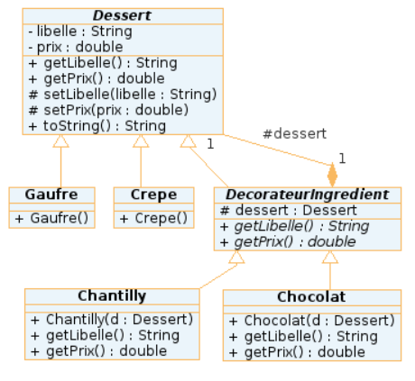

?[A quoi sert le design pattern Decorator ?]
-[ ]Definir plusieurs méthodes interchangeables dynamiquement
-[x]Ajouter dynamiquement des responsabilités supplémentaires à un objet
-[ ]A décorer
-[ ]Changer le comportement d'un objet sans changer son instanciation

?[
Cette implementation est-elle correcte ?]
-[x]Ajouter des fonctionnalités à un objet sans redéfinir ses méthodes
