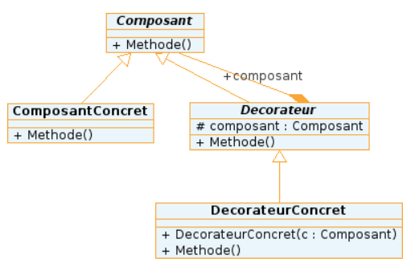

?[A quoi sert le design pattern Decorator ?]
-[ ]Definir plusieurs méthodes interchangeables dynamiquement
-[x]Ajouter dynamiquement des responsabilités supplémentaires à un objet
-[ ]A décorer
-[ ]Changer le comportement d'un objet sans changer son instanciation

?[La classe "ComposantConcret" a-t-elle accès aux méthodes de la classe "Decorateur" ?]
-[ ]Oui
-[x]Non
-[ ]Absolument aucune idée

?[Les méthodes de a classe "ComposantConcret" sont-elle redefinies dans la classe "Decorateur" ?]
-[ ]Oui
-[x]Non
-[ ]Absolument aucune idée

?[Cet exemple utilise-t-il correctement le design pattern Decorator ?]
-[x]Oui
-[ ]Non
-[ ]Absolument aucune idée

?[Parmi les 5 principes orientés objets, le design pattern decorator est-il une alternative ?]
-[ ]Polymorphisme
-[ ]Encapsulation
-[ ]Abstraction
-[ ]Composition
-[x]Heritage
