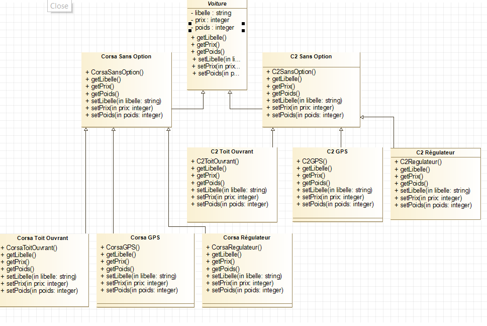
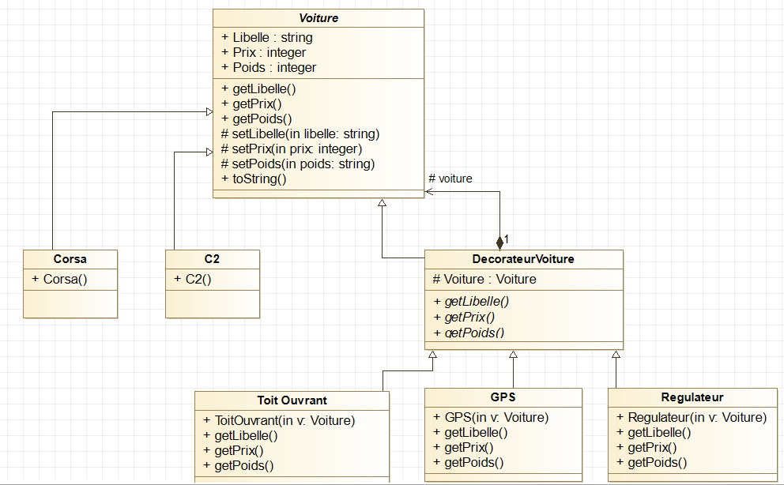

# Un exemple !

Imaginons à présent un concessionnaire qui doit vendre des voitures avec ou sans option.

On pourrais imaginer l'uml suivant :

Mais on se rend compte que le design pattern decorator est beaucoup plus intéressant ! En effet, avec le design pattern on arrive à un UML beaucoup plus simple :

