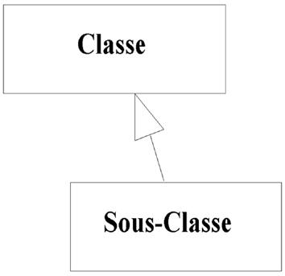
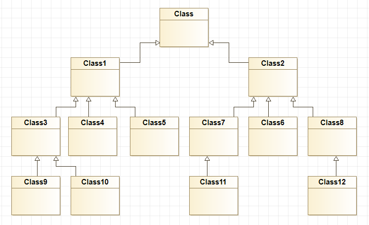

# Bonjour !

Bienvenue sur notre tech.io ! Dans cette presentation nous allons vous parler du design pattern Decorator.

# Problematique

On connait tous la manière classique d'ajouter des méthodes à un objet ou modifier son comportement sans toucher à la classe mère : l'héritage !

Mais on peut vite se retrouver avec un modele complexe avec beaucoup de classes.

De plus on ne pourra pas ajouter de fonctionnalités de façon dynamique. En effet, une fois le programme compile on ne peut pas le modifier.

Comment faire pour ajouter des fonctionnalités de façon dynamique à un de nos objets sans utiliser autant de classes ?

Heritage 
         => façon classique pour ajout
         => methodes de classes mere sont appelé depuis nouvelle classe
         => modèle complexe avec grand nombre de classes
         => ajout de fonctionnalité de façon statique ne peut pas être modifié après la compil
   
 Si l'on identifie une partie qui est sujette à de fortes évolution
   
  =======>>>>>>>>> Plus de probleme avec le Decorator

