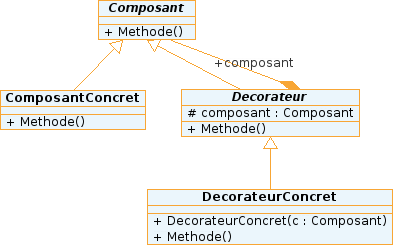

# Une solution !

Pour pallier à notre problème, on peut utiliser le **design pattern Decorator !** 

Dans ce modèle, on voit plusieurs choses : 
- On peut créer plusieurs composants concret
- On peut étendre les fonctionnalités de nos composants grâce au décorateur
- Le decorateur est une classe abstraite qui hérite de Composant et qui a un attribut Composant
- Chaque DecorateurConcret redéfinie les méthodes de Décorateur

# Interets
Lorsque le dévelopeur à vu une partie de l'application qui est sujette à beaucoup d'évolution, sa tache est grandement simplifier par ce design pattern.
